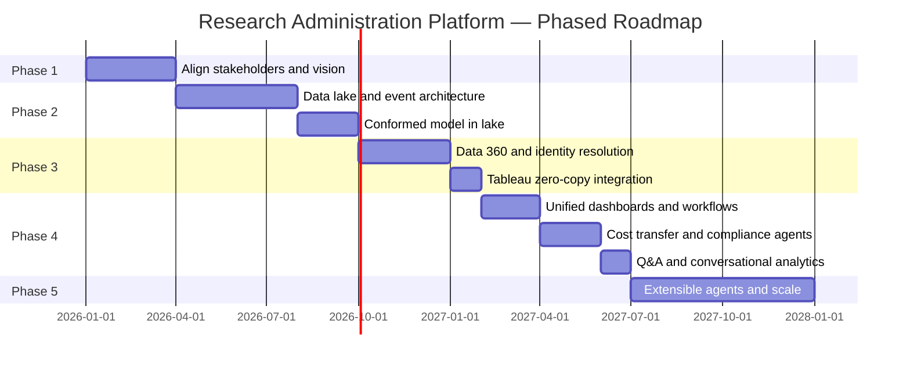
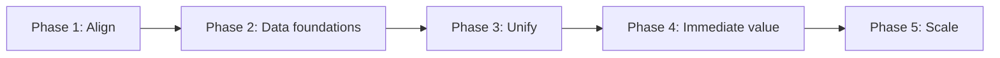

# Capability roadmap — CU Anschutz Research Administration

Phased timeline aligned to the one-pager: **Align → Data foundations → Unify → Deliver value → Scale**. Milestones and ownership by phase.

---

## 1. Phase overview (timeline)

*Durations are illustrative; institution-specific planning should set actual dates.*

---

## 2. Phase 1 — Align key stakeholders

| Milestone | Description | Owner |
|-----------|-------------|--------|
| Working Backwards–style workshops | Convene distributed stakeholders; shared definition of customer problem and end solution | Program lead / RA leadership |
| Common vision and roadmap | Documented vision, scope, and phased roadmap agreed by leadership, RA, compliance, IT, faculty reps | Program lead |
| Data and platform commitment | Agreement to data lake + unified platform approach; funding and governance | Leadership, IT |

**Outcome**: Shared problem definition, common vision, roadmap, and commitment. No technical build in this phase.

---

## 3. Phase 2 — Establish data foundations

| Milestone | Description | Owner |
|-----------|-------------|--------|
| Data lake (AWS) design and stand-up | Central lake connecting InfoEd, PeopleSoft, Cayuse, eProtocol; security and confidentiality controls | IT / Data engineering |
| Event-driven capture | Real-time capture of key events (e.g. cost transfer in ERP); connectivity to Salesforce platform | IT / Integration |
| Conformed data model in lake | Core entities (Researcher, Grant, Proposal, Award, Cost Transfer, Compliance, etc.) as dimensions/facts; source keys and lineage | Data engineering, RA data owners |
| Governance and disambiguation | Data ownership, access policy, and identity disambiguation approach | Data governance, RA |

**Outcome**: Single source of truth in the lake; event stream available for Phase 4 workflows.

---

## 4. Phase 3 — Unify and harmonize data

| Milestone | Description | Owner |
|-----------|-------------|--------|
| Data 360 deployment | Salesforce Data 360 (or equivalent); unified Researcher and Grant profiles | IT, Analytics |
| Identity resolution | Cross-system identity resolution (InfoEd, PeopleSoft, eProtocol, CU Experts) → single Researcher 360 | Data engineering, RA |
| Role-based views and access | Access control and views by persona (researcher, RA, post-award, compliance, leadership) | IT, Security |
| Natural language query and calculated insights | NL query over unified data; calculated fields for dashboards | Analytics |
| Tableau zero-copy integration | Grant portfolios, spending patterns, research trends; seamless connection to Data 360 | Analytics, BI |

**Outcome**: Golden profiles and unified views; Tableau and platform ready for Phase 4 dashboards and agents.

---

## 5. Phase 4 — Deliver immediate value

| Milestone | Description | Owner |
|-----------|-------------|--------|
| Unified dashboards and 360° portfolio views | Role-based dashboards; real-time financial monitoring (ERP + grant data); cross-system process tracking (award setup → closeout) | RA, Post-award, Analytics |
| Cost transfer agent | Event from ERP → Gen AI allowability check → Agentforce approval workflow → dashboard update | Post-award, IT |
| Proactive compliance notifications | Automated notifications for sponsor/state/federal deadlines and requirements | Compliance, IT |
| Q&A assistant | Researcher/staff questions (e.g. export control) grounded in institution-defined sources | RA, Compliance, IT |
| Conversational analytics | Tableau + autonomous agents for ad hoc questions and proactive insights over unified data | Analytics, Leadership |

**Outcome**: First visible value for each persona; cost transfer and compliance agents live; Q&A and analytics in use.

---

## 6. Phase 5 — Build extensible applications and scale

| Milestone | Description | Owner |
|-----------|-------------|--------|
| Custom agents (Einstein, Agentforce, Bedrock) | Collaborator identification; proposal evaluation; contract/agreement review and remediation; research impact visualization | RA teams, IT |
| Intelligent prospecting | Opportunity matching and prospecting support for pre-award | RA, IT |
| Ongoing scaling | New agents and apps as funding and priorities shift; reuse of 360 profiles and lake | RA teams, IT |

**Outcome**: Institution-specific agents and apps; platform scales with new use cases.

---

## 7. Dependency summary

- **Phase 4** depends on Phase 3 (Data 360 and Tableau) and Phase 2 (events for cost transfer).
- **Phase 5** builds on Phase 4 capabilities and the same data foundation; no new data model phase required.
