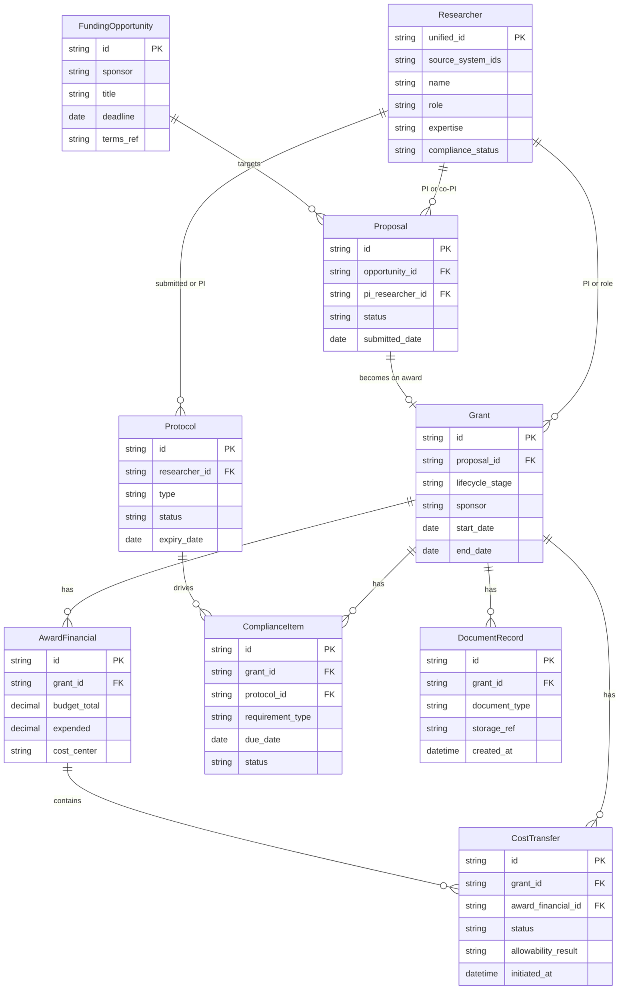

# Data Model — Connected Research Administration (CU Anschutz)

Logical data model for the unified research administration platform. Core entities support grant-lifecycle visibility, identity resolution, and agentic workflows.

---

## 1. Entity–relationship diagram

---

## 2. Core entities (summary)

| Entity | Purpose | Key attributes (logical) |
|--------|---------|---------------------------|
| **Researcher** | Unified identity across systems; roles, expertise, compliance linkage | unified_id, source_system_ids, name, role, expertise, compliance_status |
| **Funding Opportunity** | Prospect and sponsor terms for pre-award matching | id, sponsor, title, deadline, terms_ref |
| **Proposal** | Pre-award submission; links to opportunity and PI(s) | id, opportunity_id, pi_researcher_id, status, submitted_date |
| **Grant** | Award/project record; lifecycle stage from setup through closeout | id, proposal_id, lifecycle_stage, sponsor, start_date, end_date |
| **Award Financial** | Post-award financials; budgets and spend | id, grant_id, budget_total, expended, cost_center |
| **Cost Transfer** | Financial transaction triggering workflow; allowability and approval | id, grant_id, award_financial_id, status, allowability_result, initiated_at |
| **Protocol** | Regulatory/institutional protocol (e.g. IRB, IBC) | id, researcher_id, type, status, expiry_date |
| **Compliance Item** | Grant- or protocol-level compliance requirement or deadline | id, grant_id, protocol_id, requirement_type, due_date, status |
| **Document Record** | Contracts, agreements, recordkeeping references | id, grant_id, document_type, storage_ref, created_at |

---

## 3. Source system mapping

| Entity | Primary / canonical source | Contributing systems | Notes |
|--------|----------------------------|----------------------|--------|
| **Researcher** | Data 360 (identity resolution) | VIVO/CU Experts, ePERS, eProtocol, PeopleSoft | Golden profile built from multiple systems |
| **Funding Opportunity** | Pivot-RP, SPIN | — | External opportunity databases |
| **Proposal** | Cayuse, InfoEd | Pivot-RP/SPIN (opportunity link) | Pre-award system of record |
| **Grant** | InfoEd, Cayuse | PeopleSoft (financial linkage) | Lifecycle stage from eRA |
| **Award Financial** | PeopleSoft | InfoEd | ERP financials; grant linkage in lake |
| **Cost Transfer** | PeopleSoft (ERP) | — | Event source for agent workflow |
| **Protocol** | eProtocol | SciShield, OnBase | Regulatory compliance |
| **Compliance Item** | eProtocol, institutional rules | SciShield, OnBase | Sponsor/state/federal requirements |
| **Document Record** | OnBase, Cayuse | — | Document IDs/references; content may stay in source |

---

## 4. Identity resolution (Researcher 360)

Same physical person may appear as:

- **InfoEd** — proposal/grant PI or key person
- **PeopleSoft** — employee/affiliate; cost center
- **eProtocol** — protocol submitter or PI
- **VIVO / CU Experts** — profile, expertise, publications

Data 360 (or equivalent identity graph) resolves these to a single **Researcher** unified_id. All relationships (Proposal, Grant, Protocol) reference the unified Researcher for 360° views and role-based access.

---

## 5. Lifecycle and conformed model in the lake

In **Phase 2 (Data foundations)**, core entities are implemented in the AWS data lake as:

- **Conformed dimensions**: Researcher, Funding Opportunity, Grant (with lifecycle_stage), Protocol
- **Conformed facts / transactions**: Proposal (events), Cost Transfer (events), Award Financial (snapshots or deltas), Compliance Item (state and due dates)
- **Lineage**: source_system_id, source_system_name, ingested_at, last_updated_at on each entity or partition

The **unified layer (Data 360)** in Phase 3 consumes the lake and exposes Researcher 360 and Grant 360 with role-based access, NL query, and zero-copy integration to Tableau.
