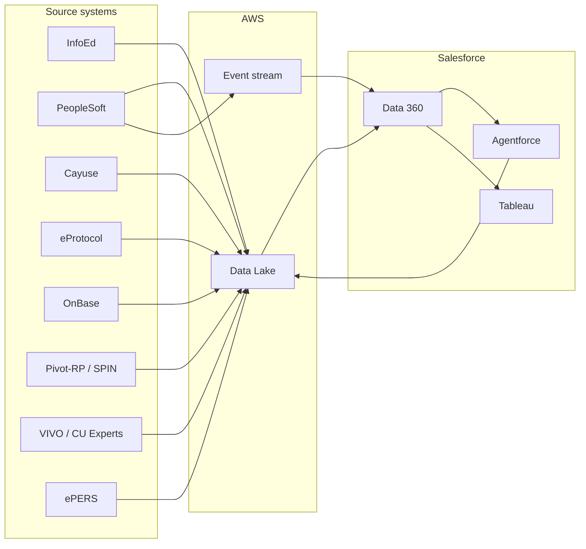
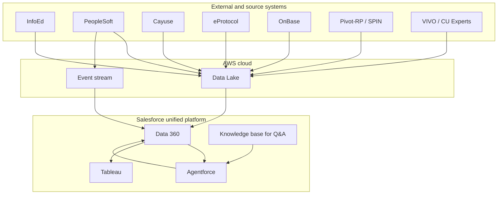

# Integration map — CU Anschutz Research Administration

High-level view of system connections: source systems ↔ AWS data lake ↔ Salesforce Data 360 ↔ Agentforce / Tableau.

---

## 1. End-to-end flow (overview)

---

## 2. Source systems → data lake (AWS)

| Source system | Data / events provided | Direction | Pattern |
|---------------|------------------------|-----------|---------|
| **InfoEd** | Proposals, grants, award metadata, key personnel | System → Lake | Batch and/or CDC / API |
| **PeopleSoft** | Financials, budgets, cost transfers, employee/affiliate | System → Lake; Cost transfer events → Event stream | Batch + event on cost transfer (real-time) |
| **Cayuse** | Proposals, submissions, opportunity links | System → Lake | Batch and/or API |
| **eProtocol** | Protocols, compliance items, PI/submitter | System → Lake | Batch and/or API |
| **OnBase** | Document references, agreements, recordkeeping | System → Lake (metadata/references) | Batch or event |
| **Pivot-RP / SPIN** | Funding opportunities | System → Lake | Batch or API |
| **VIVO / CU Experts** | Researcher profiles, expertise, scholarship | System → Lake | Batch or API |
| **ePERS** | Personnel / identity data | System → Lake | Batch or API |

- **Data lake**: single store; conformed dimensions and facts; security and confidentiality applied.
- **Event stream**: used for real-time triggers (e.g. cost transfer) that drive Agentforce workflows.

---

## 3. Data lake → Salesforce Data 360

| Flow | Description |
|------|--------------|
| **Unified profiles** | Lake dimensions and identity resolution feed Data 360; Researcher 360 and Grant 360 built and maintained. |
| **Zero-copy integration** | Data 360 queries lake (or replicated subset) without copying full datasets; control over access and governance. |
| **Event delivery** | Events (e.g. cost transfer) from lake/event bus delivered to Salesforce platform for agent triggers. |
| **Security** | Role-based access and row-level security applied in Data 360; same governance as defined for lake. |

---

## 4. Data 360 → Agentforce and Tableau

| Consumer | Connection | Use |
|----------|------------|-----|
| **Agentforce** | Data 360 as context and record source | Agents read Researcher/Grant/Compliance data for allowability, routing, notifications; write status and tasks back to platform (and optionally lake for audit). |
| **Tableau** | Zero-copy or certified connection to Data 360 | Dashboards and exploratory analytics over grant portfolios, spending, trends; NL/conversational layer on top. |
| **Einstein / Bedrock** | Called by Agentforce or platform | Allowability (cost transfer), Q&A retrieval, NL-to-query for conversational analytics; knowledge sources as configured. |

---

## 5. Component diagram (logical)

---

## 6. Key integration notes

- **Bi-directional**: The one-pager calls for “bi-directional” connections; primary flow is source → lake → Data 360. Write-back (e.g. approval status, task completion) goes platform → optional sync to lake/ERP for audit and reporting.
- **Zero-copy**: Data 360 and Tableau consume data without full duplication where possible; access and governance remain centralized.
- **Event-driven**: Cost transfer and other time-sensitive workflows use event stream from ERP to platform so agents and workflows run in near real time.
- **Compliance**: All integration paths must respect institutional security, confidentiality, and data ownership; design for audit and lineage (source_system_id, timestamps) as in the data model.
