# Persona–capability matrix — CU Anschutz Research Administration

Links personas to capabilities, lifecycle stage, agentic (Y/N), and delivery phase.

---

## 1. Matrix (table)

| Persona | Capability | Lifecycle stage | Agentic | Phase |
|---------|------------|-----------------|---------|-------|
| Faculty / Researcher | One view of my grants; portfolio visibility | Cross-lifecycle | N | 4 |
| Faculty / Researcher | Answers to policy/procedure questions (e.g. export control) | Pre-award, Post-award | Y | 4 |
| Faculty / Researcher | Collaborator identification; proposal evaluation support | Pre-award | Y | 5 |
| RA / Pre-award staff | Unified view of proposals and opportunities; tracking | Pre-award | N | 4 |
| RA / Pre-award staff | Intelligent prospecting / opportunity matching | Pre-award | Y | 5 |
| RA / Pre-award staff | Compliance and protocol visibility | Pre-award | N | 4 |
| Post-award / financial staff | Real-time financial monitoring (ERP + grant data) | Award setup, Post-award | N | 4 |
| Post-award / financial staff | Cost transfer workflow (allowability + approvals) | Post-award | Y | 4 |
| Post-award / financial staff | Cross-system process tracking (award setup → closeout) | Award setup, Post-award, Closeout | N | 4 |
| Compliance / regulatory | Proactive compliance notifications (sponsor/state/federal) | Pre-award, Post-award, Closeout | Y | 4 |
| Compliance / regulatory | Compliance and protocol visibility | Pre-award, Post-award | N | 4 |
| All (role-based) | Unified dashboards and 360° portfolio views | Cross-lifecycle | N | 4 |
| All (role-based) | Conversational analytics (Tableau + autonomous agents) | Cross-lifecycle | Y | 4 |
| Staff (RA, contracts) | Contract/agreement review and remediation | Post-award | Y | 5 |
| Leadership | Portfolio view; trends; research impact; decision support | Cross-lifecycle | N | 4 |
| Leadership | Research visualization and impact (custom) | Cross-lifecycle | Y | 5 |

---

## 2. Diagram: Persona → capability → phase

```mermaid
flowchart TB
  subgraph personas [Personas]
    P1[Faculty / Researcher]
    P2[RA / Pre-award]
    P3[Post-award / Financial]
    P4[Compliance / Regulatory]
    P5[Leadership]
  end

  subgraph phase4 [Phase 4 - Immediate value]
    C4a[Unified dashboards and 360 views]
    C4b[Real-time financial monitoring]
    C4c[Cost transfer agent]
    C4d[Compliance notification agent]
    C4e[Q&A assistant]
    C4f[Conversational analytics]
    C4g[Proposal and opportunity tracking]
  end

  subgraph phase5 [Phase 5 - Scale]
    C5a[Collaborator ID and proposal eval]
    C5b[Contract and agreement review agent]
    C5c[Research impact visualization]
    C5d[Intelligent prospecting]
  end

  P1 --> C4a
  P1 --> C4e
  P1 --> C5a
  P2 --> C4g
  P2 --> C4d
  P2 --> C5d
  P3 --> C4b
  P3 --> C4c
  P3 --> C4a
  P4 --> C4d
  P4 --> C4a
  P5 --> C4a
  P5 --> C4f
  P5 --> C5c
  P2 --> C4e
  P3 --> C5b
```

---

## 3. Summary by agentic (Y/N)

| Agentic | Count (capability–persona pairs) | Examples |
|---------|-----------------------------------|----------|
| **Y** | 9 | Cost transfer agent, compliance notifications, Q&A assistant, conversational analytics, collaborator ID, contract review, research impact viz, intelligent prospecting |
| **N** | 10 | Unified dashboards, real-time financial monitoring, proposal/opportunity tracking, cross-system process tracking, protocol visibility, leadership portfolio view |

---

## 4. Lifecycle coverage

| Lifecycle stage | Capabilities (summary) |
|-----------------|------------------------|
| **Pre-award** | Proposals and opportunities tracking; compliance/protocol visibility; Q&A assistant; (Phase 5) intelligent prospecting, collaborator ID, proposal eval |
| **Award setup** | Real-time financial monitoring; process tracking |
| **Post-award** | Cost transfer agent; financial monitoring; compliance notifications; (Phase 5) contract/agreement review |
| **Closeout** | Process tracking; compliance notifications |
| **Cross-lifecycle** | Unified dashboards; 360° views; conversational analytics; leadership portfolio and (Phase 5) research impact visualization |
